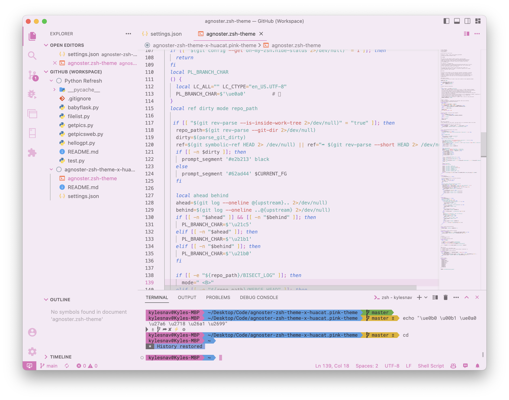

# agnoster-zsh-theme x huacat.pink-theme

A variation of [agnoster-zsh-theme](https://github.com/agnoster/agnoster-zsh-theme) theme for [ohmyzsh](https://github.com/ohmyzsh/ohmyzsh) to match the colors of [huacat.pink-theme](https://github.com/huacat1017/huacat.pink-theme).

## Visual Studio Code

See settings.json for Visual Studio Code user settings.

Font: [Roboto Mono for Powerline](https://github.com/powerline/fonts)

Color Theme: [huacat.pink-theme](https://github.com/huacat1017/huacat.pink-theme)

File Icon Theme: [Material File Icons](https://marketplace.visualstudio.com/items?itemName=PKief.material-icon-theme)

Product Icon Theme: [Material Product Icons](https://marketplace.visualstudio.com/items?itemName=PKief.material-product-icons)

## Screenshots

